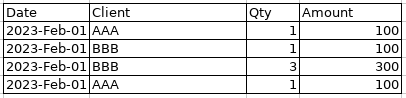

# Tutorial 1 - Getting Started

[View source on GitHub](https://github.com/RomualdRousseau/PyArchery).

This short introduction uses [PyArchery](https://github.com/RomualdRousseau/PyArchery) to:

1. Load simple tabular documents in CSV and Exce formats.
2. Display the tabular result on the console.

The expected layout of each document is a single header row followed by rows of cells:



## Setup PyArchery

### Import the package:

```python
import pyarchery
```

## Minimal code

The minimal code to load a document is as follow:

```python
with pyarchery.load(file_path, encoding="UTF-8") as doc:
    for sheet in doc.sheets:
        table = sheet.table
        if table:
            doSomethingWithHeaders(table.headers)
            doSomethingWithRows(table.rows)
```

The encoding ("UTF-8" here) is used if the encoding could not be detected when loading the document.

### Iterate overs the headers:

```python
for header in table.headers:
    # Do something with the header
```

### Iterate over the rows and cells:

```python
for row in table.rows:
    for cell in row.cells:
        # Do something with the cell
```

## Load several file formats

Here is a complete example to load and print the content of different CSV and Excel files:

```python
import pyarchery

FILE_PATHS = [
    "data/document with simple table.csv",
    "data/document with simple table.xls",
    "data/document with simple table.xlsx",
]

for file_path in FILE_PATHS:
    with pyarchery.load(file_path) as doc:
        for sheet in doc.sheets:
            table = sheet.table
            if table:
                for header in table.headers:
                    print(header.tag_value, end=" ")
                print()
                for row in table.rows:
                    for cell in row.cells:
                        print(cell.value, end=" ")
                    print()
```

```bash
date client qty amount 
2023/02/01 AAA 1 100 
2023/02/01 BBB 1 100 
2023/02/01 BBB 3 300 
2023/02/01 AAA 1 100 
date client qty amount none 
2023-02-01 AAA 1 100  
2023-02-01 BBB 1 100  
2023-02-01 BBB 3 300  
2023-02-01 AAA 1 100  
date client qty amount 
2023-02-01 AAA 1 100 
2023-02-01 BBB 1 100 
2023-02-01 BBB 3 300 
2023-02-01 AAA 1 100
```

## Conclusion

Congratulations! You have loaded documents using PyArchery.

For more examples of using PyArchery, check out the [tutorials](index.md).