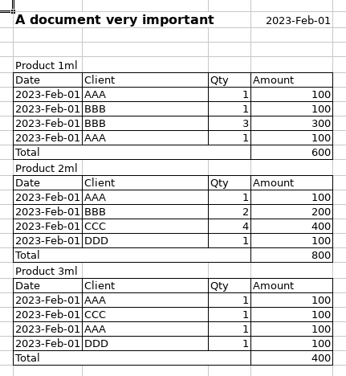

# Tutorial 2 - Data extraction with a complex semi-structured layout

[View source on GitHub](https://github.com/RomualdRousseau/PyArchery).

This tutorial will demonstrate how to use [PyArchery](https://github.com/RomualdRousseau/PyArchery) to extract data from
one Excel spreadsheet. To demonstrate the usage of this framework, we will load a document with a somewhat complex
layout, as seen here:



## Setup PyArchery

### Import the package:

```python
import pyarchery
```

## Minimal code

The minimal code to load a document is as follow:

```python
with pyarchery.load(file_path, encoding="UTF-8") as doc:
    for sheet in doc.sheets():
        table = sheet.getTable()
        if table.isPresent():
            table = table.get()
            doSomethingWithHeaders(table.headers())
            doSomethingWithRows(table.rows())
```

The encoding ("UTF-8" here) is used if the encoding could not be detected when loading the document.

## Load base model

To parse a document, PyArchery needs a model that will contains the parameters required to the parsing. Instead to start
/from an empty Model (See [Tutorial 10](tutorial_10.md)), we will start from an existing one and we will adapt it for our document. You can find a list and details of all models [here](https://github.com/RomualdRousseau/Archeryarchery-models).

The base model, we will use, is "sales-english" that has been trained on 200+ english documents containing distributor
data and with a large range of different layouts.

The base model already recognize some entities such as DATE and NUMBER. We will setup the model to add one new entity
PRODUCTNAME and we will configure a layex to extract the different elements of the documents. You can find more details
about layex.


```python
REPO_BASE_URL = "https://raw.githubusercontent.com/RomualdRousseau/Any2Json-Models/main"
MODEL_NAME = "sales-english"
FILE_PATH = "data/document with multiple tables.xlsx"
FILE_ENCODING = "UTF-8"


builder = pyarchery.model_from_uri(f"{REPO_BASE_URL}/{MODEL_NAME}/{MODEL_NAME}.json")

entities = [v for v in builder.getEntityList() if v != "PACKAGE"]
entities.append("PRODUCTNAME")

patterns = {k: v for (k, v) in builder.getPatternMap().items() if v != "PACKAGE"}
patterns["\\D+\\dml"] = "PRODUCTNAME"

parser = pyarchery.LayexTableParser(
    ["(v.$)+"], ["(()(S+$))(()([/^TOTAL/|v].+$)())+(/TOTAL/.+$)"]
)

model = (
    builder.setEntityList(entities)
    .setPatternMap(patterns)
    .setTableParser(parser)
    .build()
)
```

### Load the document

We load the document by creating a document instance with the model and options to parse the document. The hint
"pyarchery.INTELLI_LAYOUT" will tell the document instance that the document has a complex layout. The recipe
"sheet.setCapillarityThreshold(0)" will tell the parser engine to extract the features as ***small*** as possible. And finally we want the tag case to be in snake case notation:

```python
with pyarchery.load(
    FILE_PATH,
    encoding=FILE_ENCODING,
    model=model,
    hints=[pyarchery.INTELLI_LAYOUT],
    recipe=["sheet.setCapillarityThreshold(0)"],
    tag_case="SNAKE"
) as doc:
    ...
```

### Output the tabular result

Finally, we iterate over the sheets, rows and cells and outpout the data on the console:

```python
    for sheet in doc.sheets():
        table = sheet.getTable()
        if table.isPresent():
            table = table.get()
            for header in table.headers():
                print(header.getTag().getValue(), end=" ")
            print()
            for row in table.rows():
                for cell in row.cells():
                    print(cell.getValue(), end=" ")
                print()
```

```bash
a_document_very_important date product_name invoice_date client quantity amount 
A document very important 2023-02-01 Product 1ml 2023-02-01 AAA 1 100 
A document very important 2023-02-01 Product 1ml 2023-02-01 BBB 1 100 
A document very important 2023-02-01 Product 1ml 2023-02-01 BBB 3 300 
A document very important 2023-02-01 Product 1ml 2023-02-01 AAA 1 100 
A document very important 2023-02-01 Product 2ml 2023-02-01 AAA 1 100 
A document very important 2023-02-01 Product 2ml 2023-02-01 BBB 2 200 
A document very important 2023-02-01 Product 2ml 2023-02-01 CCC 4 400 
A document very important 2023-02-01 Product 2ml 2023-02-01 DDD 1 100 
A document very important 2023-02-01 Product 3ml 2023-02-01 AAA 1 100 
A document very important 2023-02-01 Product 3ml 2023-02-01 CCC 1 100 
A document very important 2023-02-01 Product 3ml 2023-02-01 AAA 1 100 
A document very important 2023-02-01 Product 3ml 2023-02-01 DDD 1 100 
```

On this output, we print out the graph of the document built during the parsing and we can see clearly the relation
between the elements of the spreadsheet and how there are structured in tabular form.

## Conclusion

Congratulations! You have loaded documents using PyArchery.

For more examples of using PyArchery, check out the [tutorials](index.md).